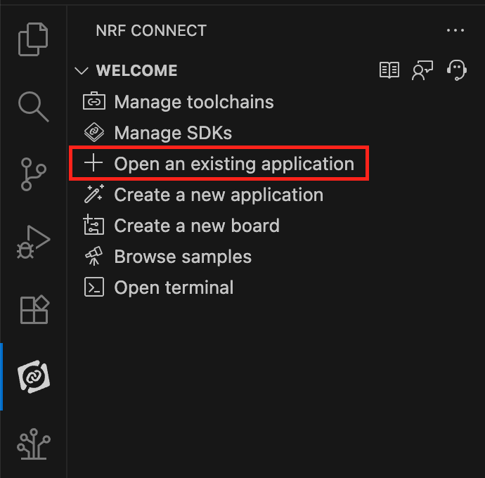
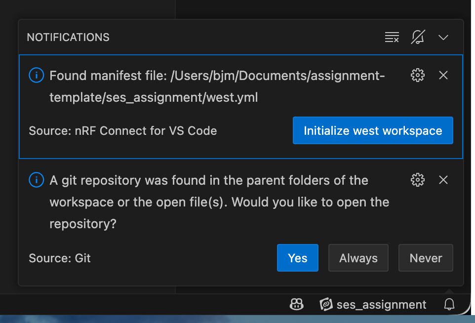
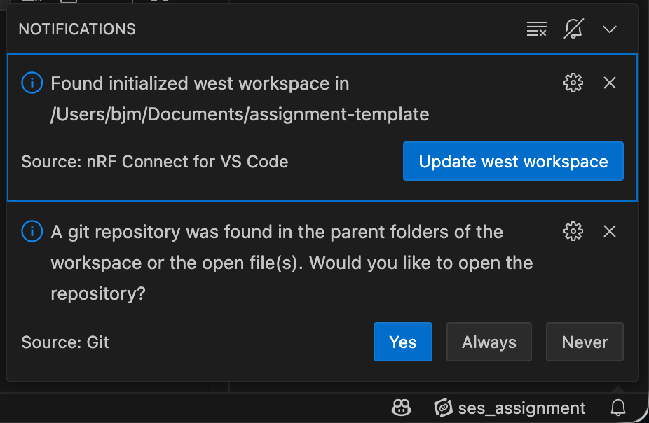
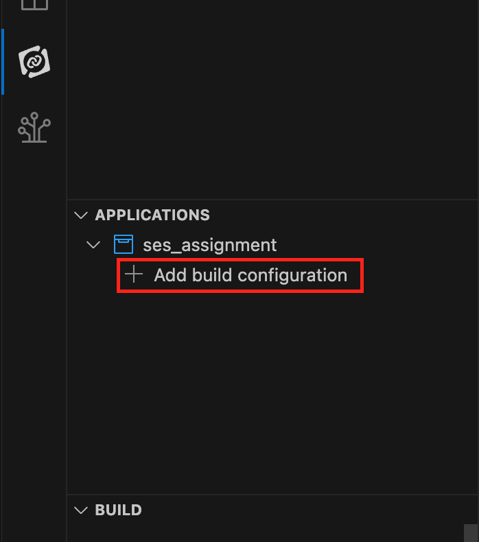
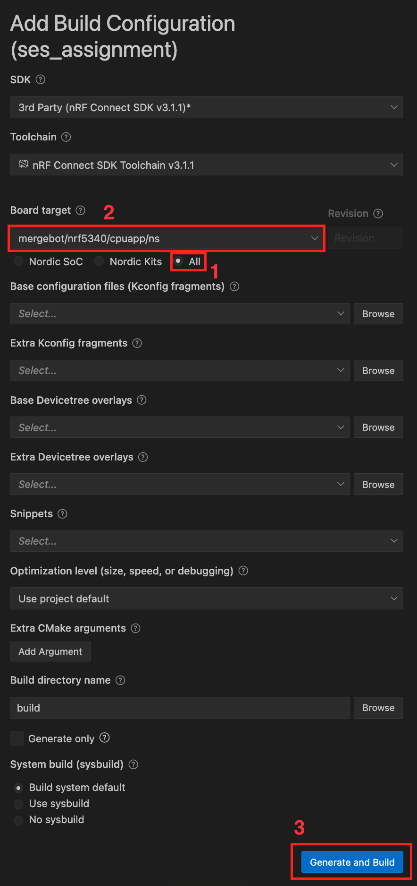
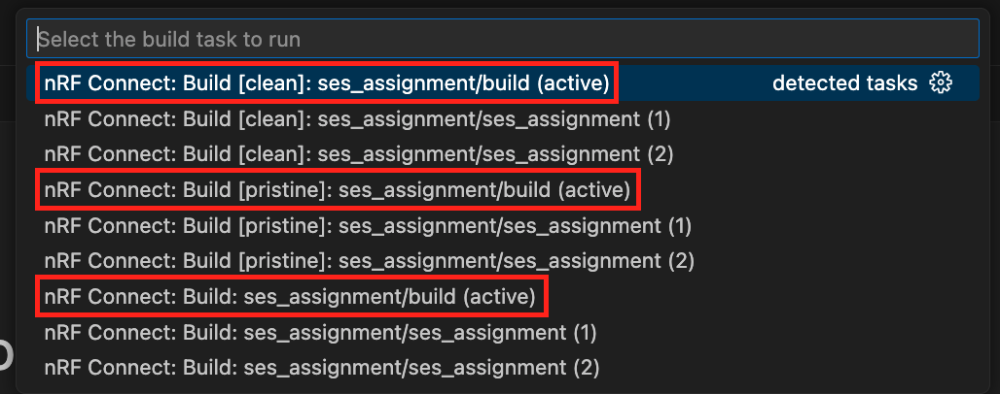
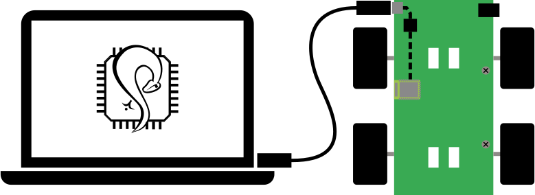

# Assignment SES 2025-2026

- [Assignment SES 2025-2026](#assignment-ses-2025-2026)
  - [Background](#background)
  - [Goal](#goal)
    - [Magnetometer](#magnetometer)
    - [Triggering Start of Routine](#triggering-start-of-routine)
    - [Crash Detection](#crash-detection)
    - [IMU Verification of Motion](#imu-verification-of-motion)
    - [Evaluation](#evaluation)
    - [Report](#report)
    - [Presentation (Only for Groups of 4)](#presentation-only-for-groups-of-4)
  - [Submission](#submission)
  - [Using this Repository with VS Code](#using-this-repository-with-vs-code)
  - [Flashing the DotBot](#flashing-the-dotbot)
  - [Hardware Resources](#hardware-resources)
  - [FAQ/Common Issues](#faqcommon-issues)

## Background

The DotBot is a swarm robotics platform developed partly at KULeuven, based on our earlier CapBot.
Instead of traditional lithium-ion batteries it uses supercapacitors for its energy storage. If you are interested in more detail on the platform, please see our paper published on the CapBot[^CapBot]. 

[^capbot]: M. Liu et al., “CapBot: Enabling Battery-Free Swarm Robotics”

## Goal
For this assignment, the goal is to let the DotBot make relative movements based on an Inertial Measurement Unit (IMU) and the hall effect sensors on the DotBot's wheels.
In order to achieve this you have to provide an implementation for the API in [`ses_assignment.h`](app/src/ses_assignment.h).
Stub implementations for API functions are already defined in [`ses_assignment.c`](app/src/ses_assignment.c).

The two API functions responsible for movement are listed below. A more detailed description for both can be found in [`ses_assignment.h`](app/src/ses_assignment.h).

```c
void move(int distance);
void turn(int angle);
```
move should be implemented with hall effect sensor data and turn should be implemented with gyroscope data. After these have a proper implementation, it should be possible to traverse relatively complex paths such as the example below.


On the demonstration day for the assignment, we will give you a path such as this that you will have to program on to the DotBot 

### Magnetometer

You will use the magnetometer on the IMU to detect magnetic north, and you should write a function that uses your turn function to face the robot toward magnetic north. 

### Triggering Start of Routine
For safety reasons, the DotBot should not start traversing the programmed path immediately after boot.
Therefore a third function in the API is supposed to make use of the IMU's double tap detection to only start moving after someone double tapped the DotBot.

```c
void wait_for_double_tap(void);
```
Whilst in this "pre-routine" state, the LED on the device should show the capacitor charge state on a continuous scale of green at maximum voltage to red at minimum voltage. 

### Crash Detection

A DotBot has no awareness of its surroundings.
Therefore it might bump into something when moving.
This should be detected with the IMU in your implementation of the `move()` function.
More formally, whenever there is a sudden deceleration the DotBot should:
1. Stop its motors
2. Wait 250ms
3. Drive in the opposite direction for a fixed amount of time (for example 1s).
4. Stop its motors
5. Display red on the LED
6. Wait forever (until reboot)

### IMU Verification of Motion
Using the IMU to verify the motion of the DotBot can provide useful feedback about undesirable behaviour such as loss of traction. In order to provide this feedback to the user, you should set the LED state to the following colours for the respective behaviour detected:

* Green: Everything running ok
* Blue: Accelerometer data shows faster velocity than wheel hall effect sensors (i.e. downhill loss of traction)
* Yellow: Accelerometer data shows slower velocity than wheel hall effect sensors (i.e. uphill loss of traction)
* Red: crash detected (as mentioned in the previous section)

### Evaluation
As a summary of what we will ask you to demonstrate during the evaluation session (with time in between to reprogram the DotBot):

* Rotate from the starting position to magnetic north and drive 1m in that direction then stop. 
* Traverse a route specified within the evaluation session, for example: drive 1m, rotate 60 deg clockwise, drive 2m, rotate 120 deg counter-clockwise, drive 0.5m, stop.
* Program the DotBot to move forward for a arbitrarily long distance so that we can evaluate the IMU verification of motion functionality. 

### Report
As part of your submission, you should provide a 2-3 page report that justifies how sensor data was utilised to fulfil the requirements, how you calibrated the thresholds for relevant functionality and attempts to improve the computational efficiency of your approach (i.e. minimising the amount of time it needs to be active on the processor).

### Presentation (Only for Groups of 4)
In order to keep the workload fair across different group sizes (in the case the class size isn't perfectly divisible by 3), any groups of 4 will additionally have to do a 15 minute presentation which extends the content of the report with more detail and an additional focus on system architecture. 

## Submission

> [!important]
> The deadline for this assignment is Sunday 30th November at 23:59.

Submission is done by simply pushing to the repository that we generated for you on GitLab.
The last commit on the **main branch** before the deadline is considered your final Submission.
The report should be part of this submission as a pdf in the top level directory of your repository. 

*If you believe there is a problem with the current API that makes it impossible or unreasonably hard to implement this assignment, please contact us such that we can discuss any changes together.*

## Using this Repository with VS Code
In order to use this repository with VS Code, you must first open the "ses_assignment" project folder as an existing application through the nRF Connect extension:



Once open, nRF Connect should detect the West manifest file present in the repository and display the following prompt (you may have to click the notification bell in the bottom right to see this popup). Click "Initialize west workspace":



It should then prompt you to update this newly initalized workspace. Click "Update west workspace":



This step will take a while as it downloads a sandboxed copy of the nRF Connect SDK/Zephyr for this project. It will also pull in the custom board definitions and libraries for the DotBot. 

Once this is complete, add a build configuration for the project through the nRF Connect extension:



Under board target, first select all board targets (1) then select mergebot/nrf5340/cpuapp/ns (2), then leave everything else as its default and click "Generate and Build" (3): 



You are able to watch the build progress in the terminal view of VS Code. 

For future builds, it is quickest to use the Ctrl + Shift + B / Cmd + Shift + B hotkey in VS Code. The list of available build configurations is long due to the relative complexity of the SoC, but the build tasks you want to run are always the "ses_assignment/build" variety. Usually a standard build is sufficient (and much faster), but if you have edited config/overlay files or are experiencing weird issues, run a pristine build (which just runs build clean before the build). 



## Flashing the DotBot

This section explains how to flash a firmware binary to the robot using [pyOCD](https://pyocd.io).

> [!NOTE]
> The "usual" way to program the robot is through pyOCD.
> In case this is not possible for whatever reason, [probe-rs](https://probe.rs) could serve as an alternative.



### pyOCD

First, install pyOCD according to its [installation instructions](https://pyocd.io/docs/installing).

Ensure pyOCD is added to your systems PATH (or you will have to copy the full path to pyOCD each time you need to run it).

You will need to install the nRF53 device pack from Nordic to have support for programming the DotBot:

```console
$ pyocd pack install nrf53 
0000295 I No pack index present, downloading now... [pack_cmd]
Downloading packs (press Control-C to cancel):
    NordicSemiconductor.nRF_DeviceFamilyPack.8.44.1
Downloading descriptors (001/001)
```

Afterwards connect the robot and verify that it's DAPLink interface is found.

```console
$ pyocd list -v

    Probe/Board             Unique ID                                          Target
-----------------------------------------------------------------------------------------
0   Arm DAPLink CMSIS-DAP   00000080066aff574884654867025126a5a5a5a597969908   n/a
```


Finally, a hex file located at `ses_assignment/build/merged.hex` can be flashed to the robot as follows:

```console
$ pyocd flash --target nrf5340_xxaa ses_assignment/build/merged.hex

0000877 I Loading ████████████████████/ses_assignment/build/merged.hex [load_cmd]
[==================================================] 100%
0007334 I Erased 86016 bytes (21 sectors), programmed 86016 bytes (21 pages), skipped 0 bytes (0 pages) at 13.12 kB/s [loader]
```


<!--
> [!NOTE]
> West (Zephyr's meta tool) also allows to flash using `west flash`.
> It automatically uses pyOCD in the background for CapBot targets.
-->


## Hardware Resources

### DotBot

The DotBot is a platform developed partly at KULeuven.
It is a battery-free robotics platform that makes use of supercapacitors instead of traditional lithium batteries for its energy storage.
It's firmware is based on Zephyr which is a real-time operating system for resource-constrained and embedded devices, and utilises the Nordic Semiconductor nRF5340 SoC.

Below is some documentation that is useful for this assignment:
- [DotBot Schematic](doc/DotBot_V3-Main-bd1.3.pdf)
- [nRF5340 Documentation](https://docs.nordicsemi.com/bundle/ps_nrf5340/page/keyfeatures_html5.html)

### IMU

The IMU that is provided for this assignment is advertised to support 9 axes:
- 3-axis gyroscope (LSM6DSOX)
- 3-axis accelorometer (LSM6DSOX)
- 3-axis magnetometer (LIS3MDL)

Below is some documentation that is useful for this assignment:
- [Schematic of the IMU board](./doc/adafruit_lsm6dsox_lis3mdl_schematic.pdf)
- [Datasheet of the LSM6DSOX](./doc/lsm6dsox_datasheet.pdf)
- [Datasheet of the LIS3MDL](./doc/lis3mdl_datasheet.pdf)


## FAQ/Common Issues

### Build

#### Pristine Build Always Required and Breaks
If VS Code keeps prompting you to do a pristine build, fails this and gets you to create a new build configuration (issue has been experienced by users just after adding a build configuration), try completely exiting out of VS Code then reopening the existing application through the nRF Connect extension. 

#### `zephyr,entropy` undeclared

An entropy source is required but not present.
Enable it by adding the following to your device tree overlay:

```dts
/ {
    chosen {
        zephyr,entropy = &cryptocell;
    };
};

&cryptocell {
    status = "okay";
};
```

### Flash

#### pyocd: command not found

Make sure you installed pyOCD according to the instructions in its [documentation](https://pyocd.io/docs/installing.html).

Make sure that the location where your pyOCD instalation lives is in your `$PATH` variable.

#### No debug probes found

It may be the case that pyOCD doesn't have sufficient permissions.
Checkout their documentation on [permission issues](https://pyocd.io/docs/installing.html#permissions-issues) and [udev rules](https://pyocd.io/docs/installing.html#udev-rules-on-linux).

#### No libusb library was found

Try explicitly installing [libusb](https://libusb.info/).
Also make sure that its [python bindings](https://pypi.org/project/libusb/) are present: `pip install libusb`

### Front Left motor stops working

The pins that drive this motor are [used for NFC by default](https://docs.nordicsemi.com/bundle/ps_nrf52832/page/pin.html#d933e2697).
The snipped below configures these pins as GPIO, make sure it is present in the compiled devicetree output.

```dts
&uicr {
    nfct-pins-as-gpios;
};
